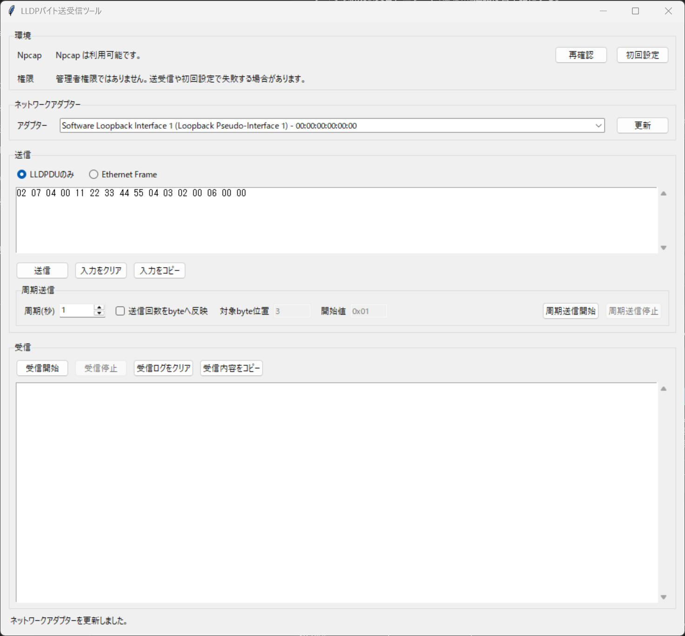

# LLDPバイト送受信ツール

Windows x64向けの、LLDPフレームを16進数byteで送受信するための日本語GUIツールです。



## 概要

LLDPバイト送受信ツールは、検証やトラブルシュート向けにLLDPの送信・受信をbyte単位で扱う小さなデスクトップアプリです。LLDPDUだけを入力してEthernetヘッダーを自動付与する使い方と、完全なEthernet Frameをそのまま送信する使い方の両方に対応しています。

## 主な機能

- LLDPDUのみの16進数byte送信
- 完全なEthernet Frameの16進数byte送信
- `1-3600秒` の周期送信
- 送信回数を指定byteへ反映するカウンター送信
- EtherType `0x88cc` のLLDPフレーム受信
- 受信フレームのEthernet Frame全体とLLDPDU部分の表示
- Npcap状態確認と同梱インストーラー起動
- 空白、改行、コロン、ハイフン区切りの16進数入力
- 全画面表示、操作、エラー文言の日本語化

## 動作環境

- Windows x64
- Npcap
- 有線LANアダプター推奨

Wi-Fi、VPN、仮想アダプターではLLDP送受信に失敗する場合があります。

## クイックスタート

通常の利用では、リリースビルド後に次のフォルダーだけを使います。

```text
dist\LLDPバイト送受信ツール
```

このフォルダー内のどちらかを実行してください。

```text
起動.bat
LLDPバイト送受信ツール.exe
```

`build`、`.pyinstaller-work`、`.pyinstaller-spec` はPyInstallerの中間作業用フォルダーです。これらの中にあるexeは実行しないでください。

## 初回設定 Npcap

WindowsでLLDPのようなレイヤー2フレームを送受信するにはNpcapが必要です。

1. `dist\LLDPバイト送受信ツール\起動.bat` を実行します。
2. 画面上部のNpcap状態を確認します。
3. `Npcap が見つかりません。初回設定を実行してください。` と表示された場合は、`初回設定` を押します。
4. Windowsの管理者権限確認が表示されたら許可します。
5. Npcapインストーラーでインストールを完了します。
6. ツールに戻り、`再確認` を押します。

通常はNpcapのデフォルト設定で利用できます。動作しない場合は、Npcapの `WinPcap API-compatible Mode` を有効にして再インストールしてください。

## 使い方

### 画面の基本操作

1. `環境` でNpcap状態を確認します。
2. `ネットワークアダプター` で送受信に使う有線LANアダプターを選択します。
3. `送信` で入力モードを選び、16進数byteを入力します。
4. `送信` ボタンで1回送信します。
5. `受信` で `受信開始` を押すとLLDPフレームの受信を開始します。
6. 受信を止める場合は `受信停止` を押します。

### LLDPDUのみで送信する

`LLDPDUのみ` モードでは、入力欄にLLDPDU部分だけを16進数で入力します。ツールが次のEthernetヘッダーを自動で付与します。

- 宛先MAC: `01:80:c2:00:00:0e`
- 送信元MAC: 選択したアダプターのMACアドレス
- EtherType: `0x88cc`

入力例:

```text
02 07 04 00 11 22 33 44 55
04 03 07 47 31
06 02 00 78
00 00
```

送信手順:

1. アダプターを選択します。
2. 入力モードで `LLDPDUのみ` を選択します。
3. 入力欄にLLDPDUの16進数byteを貼り付けます。
4. `送信` を押します。
5. 画面下部に `送信に成功しました。` と表示されれば送信完了です。

### Ethernet Frameで送信する

`Ethernet Frame` モードでは、Ethernetヘッダーを含む完全なフレームを入力します。ツールはEtherTypeがLLDP `0x88cc` であることを確認してから送信します。

入力例:

```text
01 80 C2 00 00 0E
00 11 22 33 44 55
88 CC
02 07 04 00 11 22 33 44 55
04 03 07 47 31
06 02 00 78
00 00
```

このモードでは、宛先MAC、送信元MAC、EtherTypeも入力内容がそのまま使われます。送信元MACを選択アダプターに合わせたい場合は、自分で該当byteを書き換えてください。

### 周期送信する

`周期送信` では、入力欄のbyte列を開始時にスナップショット化し、停止するまで指定周期で送信します。1回目は `周期送信開始` を押した直後に送信され、2回目以降は設定した秒数ごとに送信されます。

操作手順:

1. アダプター、入力モード、送信byteを設定します。
2. `周期(秒)` に `1` から `3600` までの整数を入力します。
3. 必要に応じて `送信回数をbyteへ反映` を有効にします。
4. `周期送信開始` を押します。
5. 停止する場合は `周期送信停止` を押します。

周期送信中は、アダプター、入力モード、入力欄、1回送信、周期送信設定がロックされます。送信中に入力欄を書き換えても、実行中の周期送信には反映されません。内容を変える場合は一度停止してから再開してください。

### 送信回数をbyteへ反映する

`送信回数をbyteへ反映` を有効にすると、現在の入力データ上の指定byteを書き換えながら周期送信できます。`対象byte位置` は1始まりです。`開始値` は `0x00` から `0xFF` の16進数で指定します。

値は次の規則で反映されます。

```text
(開始値 + 送信回数 - 1) mod 256
```

例: `対象byte位置` が `3`、`開始値` が `0x01` の場合、3byte目は次のように変化します。

```text
1回目: 0x01
2回目: 0x02
3回目: 0x03
```

`開始値` が `0xFE` の場合は次のように循環します。

```text
1回目: 0xFE
2回目: 0xFF
3回目: 0x00
```

`LLDPDUのみ` モードでは、LLDPDU入力byteを書き換えてからEthernetヘッダーを自動付与します。`Ethernet Frame` モードでは、完全なEthernet Frame入力byteを直接書き換えてから送信します。

### LLDPを受信する

受信機能は、選択したアダプターでEtherType `0x88cc` のフレームだけを表示します。

1. アダプターを選択します。
2. `受信開始` を押します。
3. LLDPフレームを受信すると、受信ログに次の情報が表示されます。
   - 受信時刻
   - インターフェース
   - 送信元MAC
   - 宛先MAC
   - EtherType
   - Ethernet Frame全体
   - LLDPDU部分
4. 受信を止める場合は `受信停止` を押します。

LLDPはリンクローカルのプロトコルです。受信確認には、LLDPを送信するスイッチ、ルーター、別PC、またはテスト用機器を同じL2リンク上に接続してください。

## 16進数入力ルール

利用できる入力例:

```text
0180c200000e
01 80 C2 00 00 0E
01:80:C2:00:00:0E
01-80-C2-00-00-0E
```

次の入力はエラーになります。

- 空入力
- 奇数桁の16進数
- `zz` など16進数ではない文字
- LLDPDUが空
- Ethernet Frameが14byte未満
- Ethernet FrameのEtherTypeが `0x88cc` ではない
- 周期が `1-3600秒` の範囲外
- 対象byte位置が入力データの範囲外
- 開始値が `0x00-0xFF` の範囲外

## よくあるエラー

### Npcap が見つかりません

`初回設定` を押してNpcapをインストールしてください。管理者権限が必要です。

### ネットワークアダプターが表示されません

Npcapのインストール後に `再確認` とアダプターの `更新` を押してください。それでも表示されない場合は、Windowsを再起動してください。

### 送信に失敗しました

次を確認してください。

- 有線LANアダプターを選択しているか
- Npcapがインストールされているか
- 管理者権限で実行しているか
- 入力byteが正しいか
- VPN、Wi-Fi、仮想アダプターを選んでいないか

### 受信ログに何も表示されません

次を確認してください。

- 同じL2リンク上にLLDP送信元があるか
- スイッチ側でLLDPが有効か
- 正しいアダプターを選択しているか
- WindowsファイアウォールやセキュリティソフトがNpcapの動作を妨げていないか

## 開発

依存関係をインストールして開発版を起動します。

```powershell
.\scripts\bootstrap.ps1
.\scripts\run.ps1
```

テストを実行します。

```powershell
.\.venv\Scripts\python.exe -m pytest
```

## リリースビルド

Npcapインストーラーを同梱する場合:

```powershell
.\scripts\build_release.ps1 -DownloadNpcap
```

生成物は `dist\LLDPバイト送受信ツール` に出力されます。

## リポジトリに含めないもの

次のファイルやフォルダーは `.gitignore` で除外しています。

- `.venv/`
- `dist/`
- `build/`
- `.pyinstaller-work/`
- `.pyinstaller-spec/`
- `drivers/npcap-*.exe`
- `*.egg-info/`
- `__pycache__/`
- `.pytest_cache/`

## ライセンス

このプロジェクト本体はMIT Licenseで公開しています。詳細は [LICENSE](LICENSE) を参照してください。

Npcapは本プロジェクトとは別のソフトウェアです。Npcapを同梱して再配布する場合は、Npcapのライセンス条件を確認してください。組織外への配布や商用配布ではNpcap OEMの再配布条件が関係する場合があります。

- Npcap公式サイト: https://npcap.com/
- Npcapリリースアーカイブ: https://npcap.com/dist/
- Npcap OEM再配布: https://npcap.com/oem/redist
